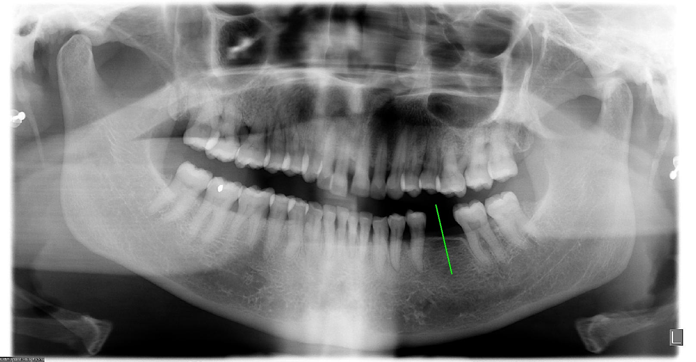

# Automated Implant Placement Pathway from Dental Pano-ramic Radiographs Using Deep Learning for Precision Clinical Assistance
<p align="center">
  
</p>

## Abstract
In today's healthcare system, dental implants have become the mainstream treatment for tooth loss. Coupled with modern society's emphasis on aesthetics and self-confidence, missing teeth not only affect appearance but also diminish quality of life and increase health risks. Although dental implant surgery generally boasts a high success rate, traditional planning remains heavily reliant on the dentist's experience. This approach is susceptible to variations in imaging quality and subjective judgment, potentially increasing surgical risks and even complications. To address this challenge, this project applies artificial intelligence (AI) to dental panoramic radiographs (DPR). By integrating YOLO object detection and Oriented Bounding Box (OBB) annotation techniques, it establishes a deep learning-assisted predictive diagnostic system. Through image enhancement and model training, it automatically identifies and annotates missing tooth regions and adjacent tooth positions, thereby calculating optimal implant placement pathways. The implementation of automated and standardized implant planning assists clinicians in determining precise implant trajectories, enhancing diagnostic efficiency while reducing the burden on healthcare systems.

## Methods
The proposed framework first applies to YOLO models to detect edentulous regions and employs image enhancement techniques to improve image quality. Subsequently, YOLO-OBB is utilized to extract pixel-level positional information of neighboring healthy teeth. An implant pathway planning visualization algorithm is applied to derive clinically relevant implant placement recommendations.

## Hyperparameter
| Hyper-parameter | value |
|:------------------:|:----:|
| Epochs | 150 |
| Batch size | 1 |
| Learning rate | 0.0005 |
| optimizer | AdamW |

## Directory Structure
* [1.YOLO](https://github.com/030didi/Dental-implant-detection/tree/main/1.YOLO), [2.YOLO-OBB](https://github.com/030didi/Dental-implant-detection/tree/main/2.YOLO-OBB): This section provides examples of training and prediction models.
* [3.YOLO-OBB](https://github.com/030didi/Dental-implant-detection/tree/main/3.%20Algorithm): Using labels predicted by YOLO and YOLO-OBB, the algorithm calculates the implant insertion path.

## Citation
```
@article{
      lin2025marginalridge,
      title={Automated Implant Placement Pathway from Dental Pano-ramic Radiographs Using Deep Learning for Precision Clinical Assistance},
      author={Pei-Yi Wu, Shih-Lun Chen, Yi-Cheng Mao, Yuan-Jin Lin, Pin-Yu Lu, Kai-Hsun Yu, Kuo-Chen Li, Tsun-Kuang Chi, Tsung-Yi Chen, and Patricia Angela R. Abu},
      journal={Diagnostics},
      year={2025},
      doi={[doi]}
}
```


